# AWS DevOps Infrastructure - Complete CI/CD Environment

A production-like AWS infrastructure setup using Terraform, featuring EKS, Jenkins, ArgoCD, Prometheus/Grafana monitoring, and a Django sample application. Designed for rapid testing and learning - deploy, test, and destroy.

## 🏗️ Architecture Overview

```
┌─────────────────────────────────────────────────────────────────────────────────────┐
│                                      AWS Cloud                                      │
│  ┌───────────────────────────────────────────────────────────────────────────────┐  │
│  │                              VPC (10.120.0.0/16)                              │  │
│  │                                                                               │  │
│  │  ┌─────────────────────────────┐    ┌─────────────────────────────────────┐   │  │
│  │  │      Public Subnets         │    │         Private Subnets             │   │  │
│  │  │  ┌───────┐ ┌───────┐ ┌───┐  │    │  ┌───────┐ ┌───────┐ ┌───────┐      │   │  │
│  │  │  │ AZ-1a │ │ AZ-1b │ │AZ-1c │    │    AZ-1a │ │ AZ-1b │ │ AZ-1c        │   │  │
│  │  │  └───────┘ └───────┘ └───┘  │    │  └───────┘ └───────┘ └───────┘      │   │  │
│  │  │         │                   │    │         │                           │   │  │
│  │  │    ┌────▼────┐              │    │    ┌────▼─────────────────────┐     │   │  │
│  │  │    │   ALB   │◄─── Internet │    │    │      EKS Cluster         │     │   │  │
│  │  │    │ (Ingress│              │    │    │  ┌─────────────────────┐ │     │   │  │
│  │  │    │Controller)             │    │    │  │    Node Group       │ │     │   │  │
│  │  │    └────┬────┘              │    │    │  │  ┌───┐ ┌───┐ ┌───┐  │ │     │   │  │
│  │  │         │                   │    │    │  │  │Pod│ │Pod│ │Pod│  │ │     │   │  │
│  │  └─────────┼───────────────────┘    │    │  │  └───┘ └───┘ └───┘  │ │     │   │  │
│  │            │                        │    │  └─────────────────────┘ │     │   │  │
│  │            │    ┌───────────────────┼────┼──────────────────────────┘     │   │  │
│  │            │    │                   │    │                                │   │  │
│  │            ▼    ▼                   │    │                                │   │  │
│  │  ┌─────────────────────────────────────────────────────────────────┐      │   │  │
│  │  │                    Kubernetes Workloads                         │      │   │  │
│  │  │  ┌──────────┐  ┌──────────┐  ┌──────────┐  ┌──────────────────┐ │      │   │  │
│  │  │  │ Jenkins  │  │  ArgoCD  │  │ Grafana  │  │   Django App     │ │      │   │  │
│  │  │  │ (CI/CD)  │  │ (GitOps) │  │Prometheus│  │  (App)           │ │      │   │  │
│  │  │  └────┬─────┘  └────┬─────┘  └──────────┘  └────────┬─────────┘ │      │   │  │
│  │  │       │             │                               │           │      │   │  │
│  │  └───────┼─────────────┼───────────────────────────────┼───────────┘      │   │  │
│  │          │             │                               │                  │   │  │
│  │          ▼             ▼                               ▼                  │   │  │
│  │  ┌──────────────┐  ┌──────────────┐           ┌──────────────┐            │   │  │
│  │  │     ECR      │  │    GitHub    │           │     RDS      │            │   │  │
│  │  │  (Images)    │  │   (GitOps)   │           │ (PostgreSQL) │            │   │  │
│  │  └──────────────┘  └──────────────┘           └──────────────┘            │   │  │
│  │                                                                           │   │  │
│  └───────────────────────────────────────────────────────────────────────────┘   │  │
│                                                                                  │  │
│  ┌─────────────────┐  ┌─────────────────┐  ┌─────────────────┐                   │  │
│  │   S3 Backend    │  │   CloudWatch    │  │   SNS Billing   │                   │  │
│  │ (Terraform State)│  │    (Logs)      │  │    Alerts       │                   │  │
│  └─────────────────┘  └─────────────────┘  └─────────────────┘                   │  │
└─────────────────────────────────────────────────────────────────────────────────────┘
```

## 🎯 What This Project Does

Creates a complete AWS environment simulating a real-world microservices setup:

- **VPC** with public/private subnets across 3 AZs
- **EKS Cluster** for container orchestration
- **Jenkins** for CI/CD pipelines (builds Docker images, pushes to ECR)
- **ArgoCD** for GitOps deployments
- **Prometheus + Grafana** for monitoring
- **RDS PostgreSQL** for database
- **ECR** for container registry
- **AWS Load Balancer Controller** for ingress (internet-facing ALBs)

### CI/CD Flow

```
Code Push → Jenkins (seed-job → goit-django-docker) → Build Image → Push to ECR → ArgoCD Sync → Deploy to EKS
```

## ⚠️ Important Disclaimer

**This is NOT production-ready.** Built for testing and learning purposes only.

Known security considerations:
- Load Balancers are internet-facing
- EBS volumes are not encrypted
- EKS and RDS can be publicly accessible
- Default credentials in examples
- Security groups allow broad access

**Always destroy resources after testing to avoid costs.**

## 📋 Prerequisites

- AWS Account with sufficient permissions
- AWS CLI configured (`aws configure`)
- Terraform >= 1.0
- kubectl
- Helm

## 🗄️ Terraform State Backend Setup

Before running Terraform, you need to create an S3 bucket for state management. This project uses S3 native locking (no DynamoDB required).

### Create Backend

```bash
# Make script executable
chmod +x setup-terraform-state-backend.sh

# Create S3 bucket for state
./setup-terraform-state-backend.sh --create
```

This creates:
- S3 bucket with versioning enabled
- AES256 encryption
- Public access blocked
- Secure transport policy (HTTPS only)
- Lab-optimized lifecycle (7 days for non-current versions)

### Delete Backend

When you're done with the project and want to clean up everything:

```bash
# Delete the S3 backend bucket (requires confirmation)
./setup-terraform-state-backend.sh --delete
```

### Backend Configuration

The backend is configured in `backend.tf`:

```hcl
terraform {
  backend "s3" {
    bucket       = "terraform-state-backend-343104031682-finance-dev"
    region       = "us-east-1"
    key          = "terraform.tfstate"
    use_lockfile = true  # S3 native locking
    encrypt      = true
  }
}
```

> **Note:** Update the bucket name in both `backend.tf` and `setup-terraform-state-backend.sh` if you want to use a different name.

## 🔐 GitHub Actions Secrets

Configure these secrets in your GitHub variables repo to be used by Actions:

| Secret | Description |
|--------|-------------|
| `AWS_ACCESS_KEY_ID` | AWS access key |
| `AWS_SECRET_ACCESS_KEY` | AWS secret key |
| `TF_REGION` | AWS region (e.g., `us-east-1`) |
| `TF_GITHUB_PAT` | GitHub Personal Access Token |
| `TF_GITHUB_USER` | GitHub username |
| `TF_GITHUB_REPO_URL` | Repository URL |
| `TF_GITHUB_BRANCH` | Branch name (e.g., `main`) |
| `TF_RDS_PASSWORD` | RDS database password |
| `TF_RDS_PUBLIC` | RDS public access (`true`/`false`) |
| `INFRACOST_API_KEY` | (Optional) For cost estimates |

## 🚀 Quick Start

### Option 1: GitHub Actions (Recommended)

1. Fork this repository
2. Configure GitHub secrets (see above)
3. Go to **Actions** → **Terraform** → **Run workflow**
4. Select deployment mode:
   - `testing` - VPC, EKS, Monitoring, ArgoCD, Jenkins, RDS
   - `minimal` - VPC, EKS, ECR only
   - `full` - All modules enabled

### Option 2: Local Deployment

```bash
# 1. Clone and configure
git clone <repo-url>
cd terra-micro-project
cp terraform.tfvars.example terraform.tfvars
# Edit terraform.tfvars with your values

# 2. Initialize and deploy
terraform init
terraform plan -var-file=testing.tfvars
terraform apply -var-file=testing.tfvars
```

## 📁 Deployment Configurations

| File | Modules Enabled | Use Case |
|------|-----------------|----------|
| `testing.tfvars` | VPC, EKS, ECR, ALB Controller, Monitoring, ArgoCD, Jenkins, RDS | Full testing |
| `minimal.tfvars` | VPC, EKS, ECR | Basic infrastructure |
| `full-deployment.tfvars` | All modules | Complete environment |

## 🔧 Module Feature Flags

Control what gets deployed via `enable_*` variables:

```hcl
enable_vpc                          = true
enable_eks                          = true
enable_ecr                          = true
enable_aws_load_balancer_controller = true
enable_monitoring                   = true
enable_argo_cd                      = true
enable_jenkins                      = true
enable_rds                          = true
enable_bastion                      = false
enable_s3                           = false
```

## 🎛️ Accessing Services

All services are exposed via AWS Application Load Balancers (internet-facing).
The passwords are set according to the app’s values.

### Get Service URLs

```bash
# List all ingress endpoints
kubectl get ingress -A

# Get specific service URLs
kubectl get ingress -n jenkins
kubectl get ingress -n argocd
kubectl get ingress -n monitoring
kubectl get ingress -n django
```

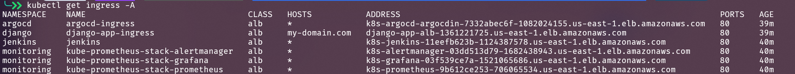

### Jenkins

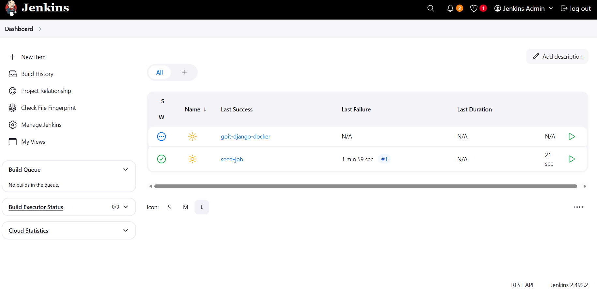

```bash
# Get Jenkins URL
kubectl get ingress -n jenkins -o jsonpath='{.items[0].status.loadBalancer.ingress[0].hostname}'
```

**Default credentials:** `admin` / `admin123`

**Setup Steps:**
1. Access Jenkins via the ALB URL
2. Go to **Manage Jenkins** → **Script Approval** → Approve the seed job script
3. Run the **seed-job** to create the `goit-django-docker` pipeline
4. Run `goit-django-docker` to build and push the Django image to ECR

### ArgoCD

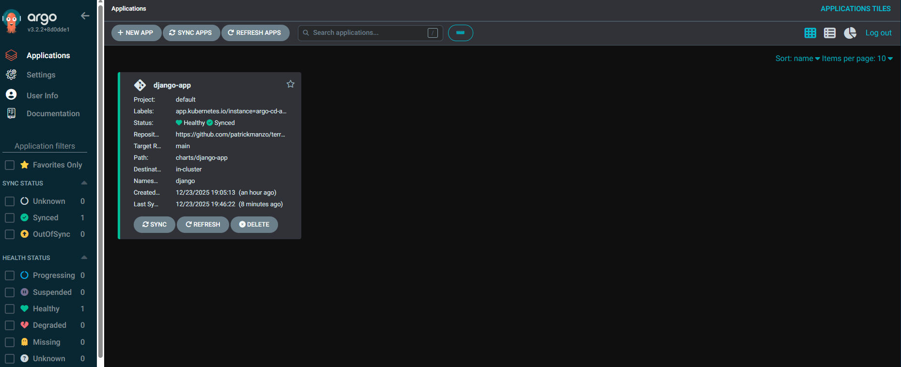

```bash
# Get ArgoCD URL
kubectl get ingress -n argocd -o jsonpath='{.items[0].status.loadBalancer.ingress[0].hostname}'
```

**Username:** `admin`

ArgoCD automatically syncs the Django application from the `charts/django-app` directory after Jenkins updates the image tag.

### Monitoring

### Grafana:
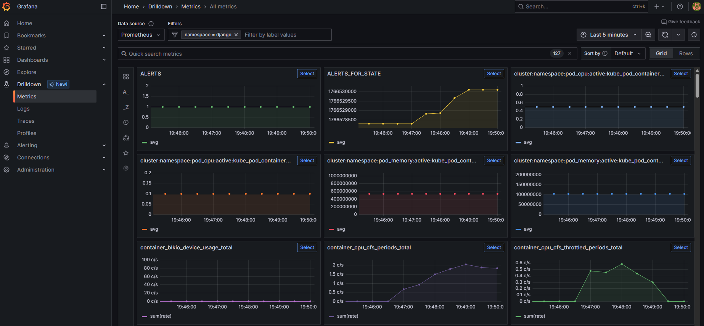

### Prometheus:
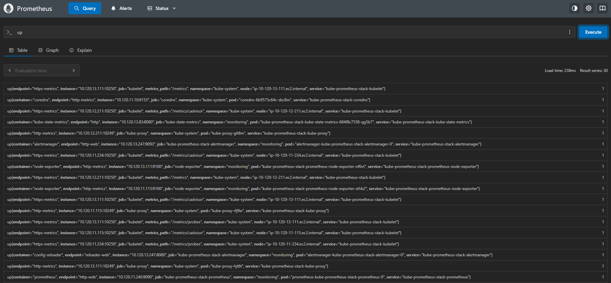

```bash
# Get Grafana URL
kubectl get ingress -n monitoring -o jsonpath='{.items[0].status.loadBalancer.ingress[0].hostname}'

```

**Username:** `admin`

Pre-configured dashboards for:
- Kubernetes cluster metrics
- Node CPU/Memory usage
- Pod metrics
- EKS-specific dashboards

### Django Application

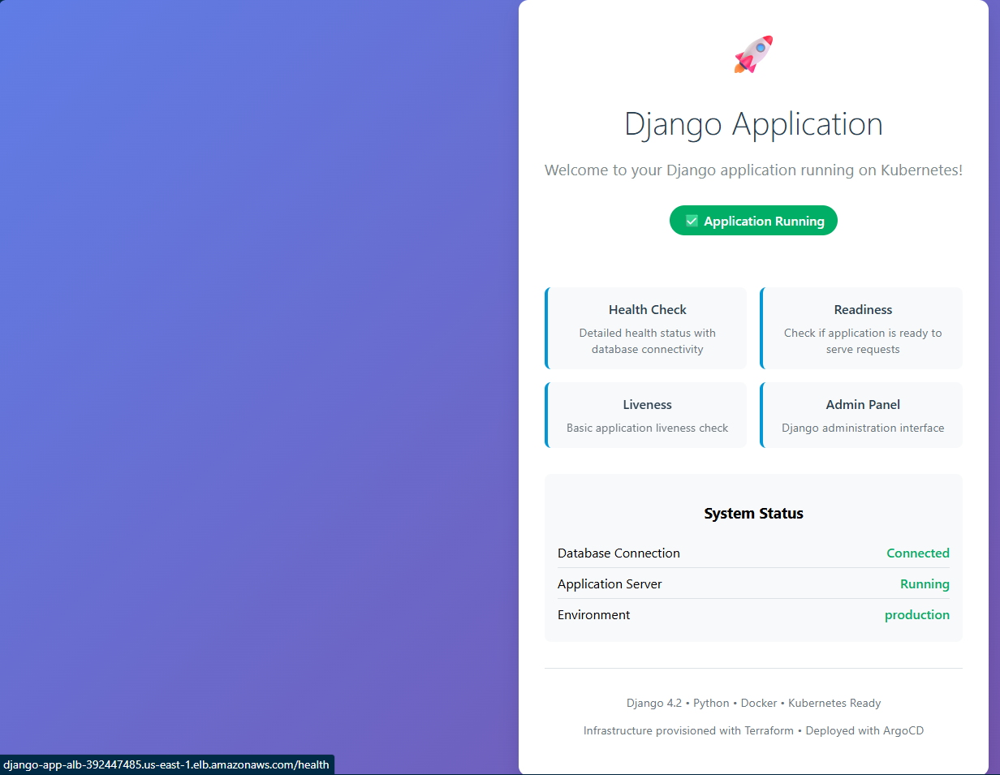

```bash
# Get Django app URL (after ArgoCD deploys it)
kubectl get ingress -n django -o jsonpath='{.items[0].status.loadBalancer.ingress[0].hostname}'
```

## AWS

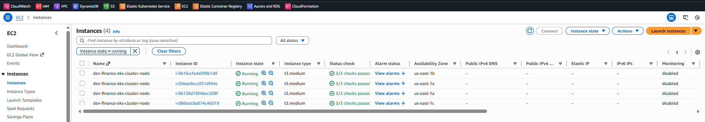

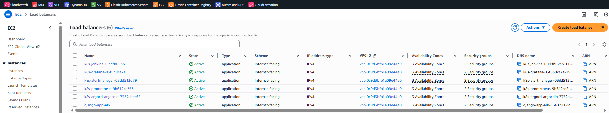

## Kubernetes

#### Configure kubeconfig
```bash
aws eks update-kubeconfig --region us-east-1 --name dev-finance-eks-cluster
```

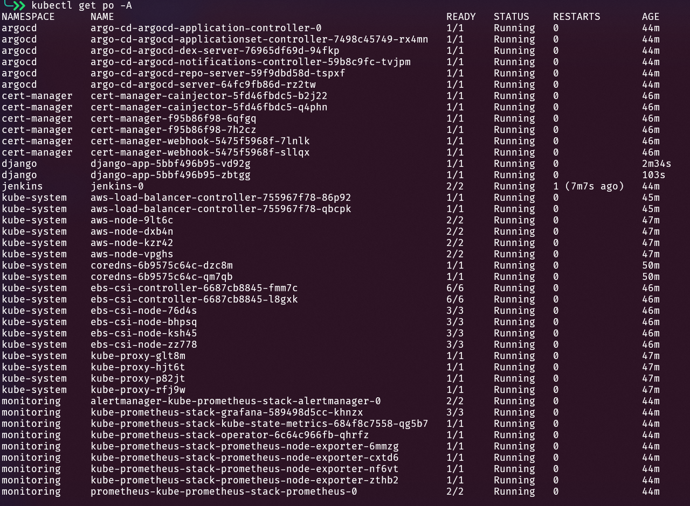

## 📊 RDS Configuration

Configure RDS via variables:

```hcl
rds_use_aurora              = false          # true for Aurora, false for standard RDS
rds_instance_class          = "db.t3.micro"
rds_database_name           = "financedb"
rds_username                = "postgres"
rds_publicly_accessible     = true           # Set false for production
rds_multi_az                = false          # Set true for HA
rds_backup_retention_period = 0              # Days to retain backups
```

Get RDS endpoint:
```bash
terraform output rds_endpoint
```

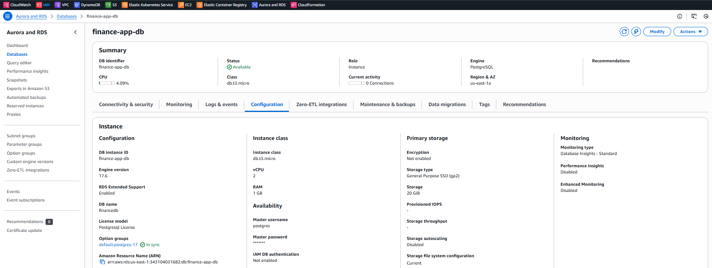

## 🔄 CI/CD Pipeline Flow

```
┌─────────────┐     ┌─────────────┐     ┌─────────────┐     ┌─────────────┐
│  Code Push  │────▶│   Jenkins   │────▶│     ECR     │────▶│   ArgoCD   │
│  (GitHub)   │     │  (Build)    │     │  (Registry) │     │   (Deploy)  │
└─────────────┘     └─────────────┘     └─────────────┘     └─────────────┘
                           │                                       │
                           │         ┌─────────────┐              │
                           └────────▶│  Create PR  │             │
                                     │ (image tag) │              │
                                     └─────────────┘              │
                                                                  ▼
                                                            ┌─────────────
                                                            │     EKS     │
                                                            ┌─────────────
                                                            │  (Runtime)  │
                                                            └─────────────┘
```

1. **Jenkins seed-job** creates the `goit-django-docker` pipeline
2. **goit-django-docker** builds the Django image using Kaniko
3. Image is pushed to **ECR** with tag `v1.0.{BUILD_NUMBER}`
4. Jenkins creates a **PR** updating `charts/django-app/values.yaml` with new tag
5. After PR merge, **ArgoCD** detects the change and syncs
6. New version deployed to **EKS**

### Build Pipeline:

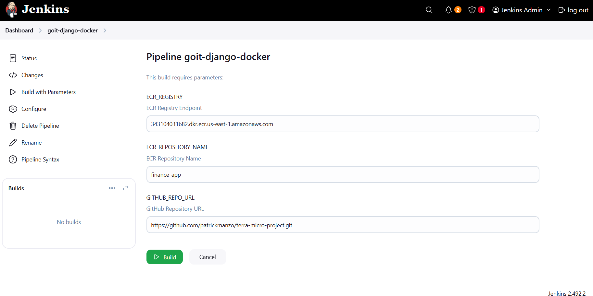

### Automatic Pull Request:

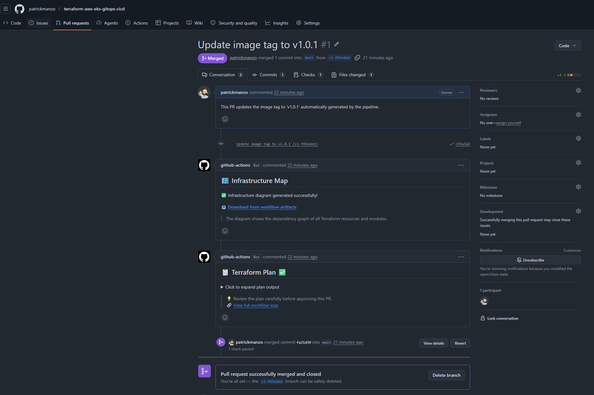

#### *Actions that only run in Pull Requests

## 🗑️ Destroying Infrastructure

### Option 1: GitHub Actions

Go to **Actions** → **Terraform** → **Run workflow** → Select `destroy`

### Option 3: Manual

```bash
# Step 1: Remove Helm releases
helm uninstall jenkins -n jenkins
helm uninstall argo-cd -n argocd
helm uninstall kube-prometheus-stack -n monitoring

# Step 2: Wait for ALBs to detach
sleep 60

# Step 3: Destroy with Terraform
terraform destroy -auto-approve
```

## 📁 Project Structure

```
.
├── .github/workflows/          # GitHub Actions CI/CD
├── charts/
│   └── django-app/             # Helm chart for Django app
│       ├── Chart.yaml
│       ├── templates/          # K8s manifests (deployment, service, ingress, etc.)
│       └── values.yaml
├── data/                       # Screenshots for documentation
│   ├── jenkins.png
│   ├── argo.png
│   └── grafana.png
│   └── ...
├── django/                     # Django application source
│   ├── Dockerfile
│   ├── Jenkinsfile             # CI/CD pipeline definition
│   ├── Makefile
│   ├── docker-compose.yml
│   ├── jenkins/                # Additional Jenkins pipeline scripts
│   ├── manage.py
│   ├── myproject/              # Django project code
│   ├── requirements.txt
│   ├── staticfiles/
│   └── tests/
├── modules/                    # Terraform modules
│   ├── argo_cd/
│   ├── aws_load_balancer_controller/
│   ├── bastion/
│   ├── ec2/
│   ├── ecr/
│   ├── eks/
│   ├── jenkins/
│   ├── lb/
│   ├── monitoring/
│   ├── rds/
│   ├── s3/
│   ├── security_groups/
│   └── vpc/
├── test/                       # Terratest tests
│   ├── terraform_argocd_test.go
│   ├── terraform_basic_test.go
│   ├── terraform_eks_test.go
│   └── terraform_vpc_test.go
├── main.tf                     # Main configuration & locals
├── modules.tf                  # Module instantiation
├── variables.tf                # Variable definitions
├── outputs.tf                  # Output definitions
├── providers.tf                # Provider configuration
├── backend.tf                  # S3 backend configuration
├── testing.tfvars              # Testing deployment config
├── minimal.tfvars              # Minimal deployment config
├── full-deployment.tfvars      # Full deployment config
├── terraform.tfvars.example    # Example variables file
├── setup-terraform-state-backend.sh  # S3 backend setup script
└── setup-pre-commit.sh         # Pre-commit hooks setup
```

## 🔄 GitHub Actions CI/CD Pipeline

The workflow (`.github/workflows/terraform.yml`) runs on PRs, pushes to main, and manual triggers.

### Pipeline Stages

```
┌─────────────┐   ┌─────────────┐   ┌─────────────┐   ┌─────────────┐
│   Checkout  │──▶│  Terraform  │──▶│   Validate  │──▶│   Security  │
│    & Init   │   │  fmt check  │   │   & TFLint  │   │    TFSec    │
└─────────────┘   └─────────────┘   └─────────────┘   └─────────────┘
                                                              │
┌─────────────┐   ┌─────────────┐   ┌─────────────┐           │
│   Deploy    │◀──│    Plan     │◀──│  Infracost  │◀──────────┘
│   (Apply)   │   │  & Comment  │   │  & Infra Map│
└─────────────┘   └─────────────┘   └─────────────┘
```

### What Each Stage Does

| Stage | Description |
|-------|-------------|
| `terraform fmt` | Checks code formatting (fails PR if not formatted) |
| `terraform validate` | Validates configuration syntax |
| `TFLint` | Lints Terraform code for best practices |
| `TFSec` | Security scanning for misconfigurations |
| `Infracost` | Estimates monthly AWS costs (comments on PR) |
| `Infrastructure Map` | Generates dependency graph (uploaded as artifact) |
| `terraform plan` | Shows what will change (comments on PR) |
| `terraform apply` | Deploys infrastructure (2-phase: AWS first, then K8s) |

### Workflow Triggers

- **Pull Request**: Runs validation, security checks, cost estimate, and plan (comments results on PR)
- **Push to main**: Full deployment with selected tfvars
- **Manual dispatch**: Choose `apply` or `destroy` + deployment mode (`testing`, `minimal`, `full`)

### Two-Phase Deployment

1. **Phase 1**: Deploy AWS infrastructure (VPC, EKS, ECR, RDS, S3)
2. **Wait**: EKS cluster becomes ready, kubeconfig is configured
3. **Phase 2**: Deploy Kubernetes resources (Jenkins, ArgoCD, Monitoring, ALB Controller)

## 🧪 Terratest

Infrastructure tests using [Terratest](https://terratest.gruntwork.io/) (Go-based testing framework).

### Available Tests

| Test File | What It Tests |
|-----------|---------------|
| `terraform_basic_test.go` | Basic Terraform init/plan validation |
| `terraform_vpc_test.go` | VPC creation, subnets, routing |
| `terraform_eks_test.go` | EKS cluster deployment |
| `terraform_argocd_test.go` | ArgoCD installation |

### Running Tests

```bash
cd test

# Run all tests
go test -v -timeout 60m

# Run specific test
go test -v -timeout 30m -run TestVPC

# Run with shorter timeout for basic tests
go test -v -timeout 10m -run TestBasic
```

### Test Requirements

- Go 1.19+
- AWS credentials configured
- Sufficient AWS permissions

## 💰 Cost Considerations

This infrastructure incurs AWS costs. Main cost drivers:
- EKS cluster (~$0.10/hour for control plane)
- EC2 instances (node group)
- Load Balancers (~$0.025/hour each)
- RDS instance (if enabled)
- NAT Gateway (~$0.045/hour)

**Tip:** Use `minimal.tfvars` for basic testing to reduce costs.

## 📝 Terraform Outputs

After deployment:

```bash
terraform output eks_cluster_name
terraform output eks_cluster_endpoint
terraform output ecr_repository_url
terraform output rds_endpoint
terraform output vpc_id
```

## 🔗 Useful Commands

```bash
# Check cluster status
kubectl get nodes
kubectl get pods -A

# Check deployments
kubectl get deployments -A

# View logs
kubectl logs -n jenkins -l app.kubernetes.io/name=jenkins
kubectl logs -n argocd -l app.kubernetes.io/name=argocd-server

# Check ALB status
kubectl get ingress -A -o wide
```

## 📄 License

MIT License - See [LICENSE](LICENSE) file.
